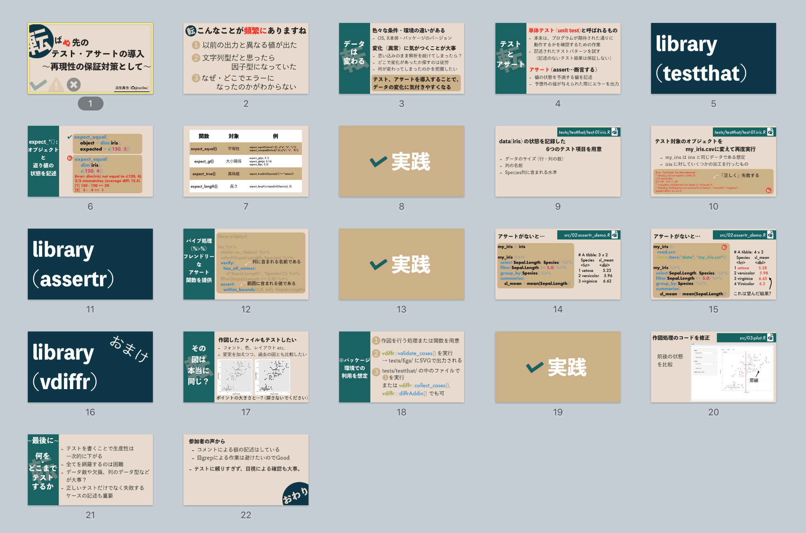

転ばぬ先のテスト・アサートの導入〜再現性の保証対策として〜
================

Author: Shinya Uryu ([\@uribo](https://github.com/uribo))

## Slide

https://speakerdeck.com/s_uryu/rcode-test-assert



- [inst/slide.key](https://github.com/uribo/talk_180822_rcode-test-assert/blob/master/inst/slide.key)
- [inst/slide.pdf](https://github.com/uribo/talk_180822_rcode-test-assert/blob/master/inst/slide.pdf)

## Running

**On Binder**

Click build start at binder!

[](https://mybinder.org/v2/gh/uribo/talk_180822_rcode-test-assert/master)


## References

- http://testthat.r-lib.org
- https://github.com/ropensci/assertr
- https://github.com/lionel-/vdiffr
- [Rでアサートする系のパッケージ：ensurer, assertthat, assertr](https://notchained.hatenablog.com/entry/2015/03/22/140656)
- [アサートを使って堅牢なデータ設計をしよう](https://uribo.hatenablog.com/entry/2016/03/19/110000)
- [RStudio と vdiffr でプロットもテストしよう](https://qiita.com/kozo2/items/62193e74ab2239e3a1be)

## Session Information

```r
sessioninfo::session_info()
─ Session info ────────────────────────────────────────────────────────────────────────
 setting  value                       
 version  R version 3.5.0 (2018-04-23)
 os       macOS High Sierra 10.13.6   
 system   x86_64, darwin15.6.0        
 ui       RStudio                     
 language En                          
 collate  ja_JP.UTF-8                 
 tz       Asia/Tokyo                  
 date     2018-08-26                  

─ Packages ────────────────────────────────────────────────────────────────────────────
 package           * version    date       source                         
 assertr           * 2.5        2018-02-23 CRAN (R 3.5.0)                 
 assertthat          0.2.0      2017-04-11 CRAN (R 3.5.0)                 
 backports           1.1.2      2017-12-13 CRAN (R 3.5.0)                 
 bindr               0.1.1      2018-03-13 CRAN (R 3.5.0)                 
 bindrcpp          * 0.2.2      2018-03-29 CRAN (R 3.5.0)                 
 cli                 1.0.0      2017-11-05 CRAN (R 3.5.0)                 
 clisymbols          1.2.0      2017-05-21 CRAN (R 3.5.0)                 
 colorspace          1.3-2      2016-12-14 CRAN (R 3.5.0)                 
 crayon              1.3.4      2017-09-16 CRAN (R 3.5.0)                 
 dplyr             * 0.7.6      2018-06-29 CRAN (R 3.5.0)                 
 fansi               0.3.0      2018-08-13 CRAN (R 3.5.0)                 
 fontBitstreamVera   0.1.1      2017-02-01 CRAN (R 3.5.0)                 
 fontLiberation      0.1.0      2016-10-15 CRAN (R 3.5.0)                 
 fontquiver          0.2.1      2017-02-01 CRAN (R 3.5.0)                 
 freetypeharfbuzz    0.1.0      2018-06-12 CRAN (R 3.5.0)                 
 gdtools           * 0.1.7      2018-02-27 CRAN (R 3.5.0)                 
 ggplot2           * 3.0.0      2018-07-03 CRAN (R 3.5.0)                 
 glue                1.3.0      2018-08-01 Github (tidyverse/glue@a292148)
 gtable              0.2.0      2016-02-26 CRAN (R 3.5.0)                 
 here                0.1        2017-05-28 CRAN (R 3.5.0)                 
 hms                 0.4.2      2018-03-10 CRAN (R 3.5.0)                 
 labeling            0.3        2014-08-23 CRAN (R 3.5.0)                 
 lazyeval            0.2.1      2017-10-29 CRAN (R 3.5.0)                 
 magrittr            1.5        2014-11-22 CRAN (R 3.5.0)                 
 munsell             0.5.0      2018-06-12 CRAN (R 3.5.0)                 
 pillar              1.3.0      2018-07-14 CRAN (R 3.5.0)                 
 pkgconfig           2.0.2      2018-08-16 CRAN (R 3.5.0)                 
 plyr                1.8.4      2016-06-08 CRAN (R 3.5.0)                 
 purrr               0.2.5      2018-05-29 CRAN (R 3.5.0)                 
 R6                  2.2.2      2017-06-17 CRAN (R 3.5.0)                 
 Rcpp                0.12.18    2018-07-23 CRAN (R 3.5.0)                 
 readr               1.1.1      2017-05-16 CRAN (R 3.5.0)                 
 rlang               0.2.2      2018-08-16 CRAN (R 3.5.0)                 
 rprojroot           1.3-2      2018-01-03 CRAN (R 3.5.0)                 
 rstudioapi          0.7        2017-09-07 CRAN (R 3.5.0)                 
 scales              1.0.0      2018-08-09 CRAN (R 3.5.0)                 
 sessioninfo         1.0.0      2017-06-21 CRAN (R 3.5.0)                 
 testthat          * 2.0.0      2017-12-13 CRAN (R 3.5.0)                 
 tibble              1.4.2      2018-01-22 CRAN (R 3.5.0)                 
 tidyselect          0.2.4      2018-02-26 CRAN (R 3.5.0)                 
 utf8                1.1.4      2018-05-24 CRAN (R 3.5.0)                 
 vdiffr              0.2.3.9000 2018-05-07 Github (lionel-/vdiffr@cd9ba84)
 withr               2.1.2      2018-03-15 CRAN (R 3.5.0)  
```


